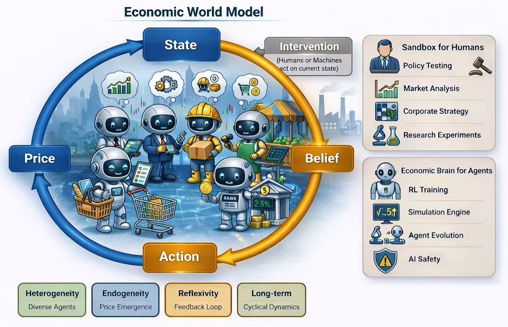

<h1 align="center">Awesome Economic World Models 🌐</h1>

  
  <!-- 
  
  -->
  A curated collection of papers, projects, and resources on Economic World Models.

  

  

## 🔥 News
- [2026/03/24] Initial release of the Awesome-Econ-World-Models GitHub repository.

## 🌐 What is An Economic World Model?

An Economic World Model (EconWM) is a data-driven **imagination engine** for understanding and simulating economic systems, enabling humans and machines to explore *what-if* futures under alternative actions and interventions.

---

## 🗂️ Table of Contents

- [Getting Started with World Models](#getting-started-with-world-models)
  - [Surveys and Tutorials](#-surveys-and-tutorials)
  - [General World Models](#-general-world-models)
  - [Generative and Interactive World Models](#-generative-and-interactive-world-models)

- [Economic World Models](#-economic-world-models)
  - [Rule-Based Economic Modeling](#-rule-based-economic-modeling)
  - [Feature- and Data-Driven Economic Modeling](#-feature--and-data-driven-economic-modeling)
  - [Prompt- and Context-Based Economic Agents](#-prompt--and-context-based-economic-agents)
  - [Multi-Agent Economic Simulation](#-multi-agent-economic-simulation)
  - [Environment-Centric Economic World Models](#-environment-centric-economic-world-models)
  
- [Applications](#-applications)
  - [Sandbox for Humans](#-sandbox-for-humans)
  - [Economic Brain for Machines](#-economic-brain-for-machines)
  
- [Projects and Platforms](#-projects-and-platforms)
  
- [Blogs and Perspectives](#-blogs-and-perspectives)

- [Contributing](#-contributing)

---

## Getting Started with World Models

### 📚 Surveys and Tutorials

Broad overviews that help newcomers understand the landscape.

- Understanding World or Predicting Future? A Survey of World Models. [[Paper](https://arxiv.org/abs/2411.14499)]
  
- From Efficient Multimodal Models to World Models: A Survey. [[Paper](https://arxiv.org/abs/2407.00118)]

- A Comprehensive Survey on World Models for Embodied AI. [[Paper](https://arxiv.org/abs/2510.16732)]

- Is Sora a World Simulator? A Comprehensive Survey on General World Models and Beyond. [[Paper](https://arxiv.org/abs/2405.03520)]

- World models for autonomous driving: An initial survey. [[Paper](https://ieeexplore.ieee.org/abstract/document/10522953)]

- Learning to Model the World: A Survey of World Models in Artificial Intelligence. [[Paper](https://www.preprints.org/manuscript/202603.0739)]

### 🔹 General World Models

Foundational papers that shape the modern notion of learning internal models of environment dynamics.

- World Models. David Ha, Jürgen Schmidhuber, 2018. [[Paper](https://arxiv.org/abs/1803.10122)]

- Recurrent World Models Facilitate Policy Evolution. David Ha, Jürgen Schmidhuber, 2018. [[Paper](https://proceedings.neurips.cc/paper/2018/hash/2de5d16682c3c35007e4e92982f1a2ba-Abstract.html)]

- Dream to Control: Learning Behaviors by Latent Imagination. Danijar Hafner et al., 2019. [[Paper](https://arxiv.org/abs/1912.01603)]
 
- Mastering Atari with Discrete World Models (DreamerV2). Danijar Hafner et al., 2020. [[Paper](https://arxiv.org/abs/2010.02193)]

- A Path Towards Autonomous Machine Intelligence (JEPA). Yann LeCun, 2022. [[Paper](https://openreview.net/pdf?id=BZ5a1r-kVsf&utm_source=pocket_mylist)]

- Inner Monologue: Embodied Reasoning through Planning with Language Models. Weilong Huang et al., 2022. [[Paper](https://arxiv.org/abs/2207.05608)]

- A Generalist Agent. Scott Reed et al., 2022. [[Paper](https://arxiv.org/abs/2205.06175)]

- Mastering Diverse Domains through World Models (DreamerV3). Danijar Hafner et al., 2023. [[Paper](https://arxiv.org/abs/2301.04104)]

- Language Models Represent Space and Time. Wes Gurnee, Max Tegmark, 2023. [[Paper](https://arxiv.org/abs/2310.02207)]

- General Agents Need World Models. Jonathan Richens et al., 2025. [[Paper](https://openreview.net/forum?id=dlIoumNiXt)]

- Mastering Diverse Control Tasks Through World Models. Danijar Hafner et al., 2025. [[Paper](https://www.nature.com/articles/s41586-025-08744-2)]

### 🎬 Generative and Interactive World Models

Representative works that extend world models from latent RL environments to multimodal generation, interactive simulation, and embodied environments.

- **MineDojo:** Building Open-Ended Embodied Agents with Internet-Scale Knowledge. Linxi Fan et al., 2022. [[Paper](https://proceedings.neurips.cc/paper_files/paper/2022/hash/74a67268c5cc5910f64938cac4526a90-Abstract-Datasets_and_Benchmarks.html)]

- **GAIA-1:** A Generative World Model for Autonomous Driving. Wayve, 2023. [[Paper](https://arxiv.org/abs/2309.17080)]

- Learning to Model the World with Language. Jialu Lin et al., 2023. [[Paper](https://arxiv.org/abs/2308.01399)]

- **UniSim** - Learning Interactive Real-World Simulators. Sherry Yang et al., 2023. [[Paper](https://arxiv.org/abs/2310.06114)]

- **Sora** - Video Generation Models as World Simulators. OpenAI, 2024. [[Paper](https://openai.com/index/video-generation-models-as-world-simulators/)]

- **SIMA/SIMA 2** - Scalable Instructable Multiworld Agent. Google DeepMind, 2024. [[Paper](https://deepmind.google/blog/sima-generalist-ai-agent-for-3d-virtual-environments/)] [[Paper](https://deepmind.google/blog/sima-2-an-agent-that-plays-reasons-and-learns-with-you-in-virtual-3d-worlds/)]

- **Genie:** Generative Interactive Environments. Bruce et al., 2024. [[Paper](https://openreview.net/forum?id=bJbSbJskOS)]

- **Genie 2:** A Large-Scale Foundation World Model. Google DeepMind, 2024. [[Paper](https://deepmind.google/blog/genie-2-a-large-scale-foundation-world-model/)]

- **Pandora:** Towards General World Model with Natural Language Actions and Video States. Jiannan Xiang et al., 2024. [[Paper](https://arxiv.org/abs/2406.09455)]

- **Project Sid:** Many-agent simulations toward AI civilization. Altera AL et al., 2024. [[Paper](https://arxiv.org/abs/2411.00114)]

- Learning to Model the World with Language. Lin et al., 2024. [[Paper](https://arxiv.org/abs/2308.01399)]

- **MineDreamer:** Learning to Follow Instructions via Chain-of-Imagination for Simulated-World Control. Enshen Zhou et al., 2024. [[Paper](https://arxiv.org/abs/2403.12037)]

- **Sim-gen:** Simulator-conditioned driving scene generation. Yunsong Zhou et al., 2024. [[Paper](https://proceedings.neurips.cc/paper_files/paper/2024/hash/57c5a7c83b056d74bc97b7db36bd3649-Abstract-Conference.html)]

- **EgoAgent:** A Joint Predictive Agent Model in Egocentric Worlds. Lu Chen et al., 2025. [[Paper](https://openaccess.thecvf.com/content/ICCV2025/html/Chen_EgoAgent_A_Joint_Predictive_Agent_Model_in_Egocentric_Worlds_ICCV_2025_paper.html)]

- **HERMES:** A Unified Self-Driving World Model for Simultaneous 3D Scene Understanding and Generation. Xin Zhou et al., 2025. [[Paper](https://openaccess.thecvf.com/content/ICCV2025/html/Zhou_HERMES_A_Unified_Self-Driving_World_Model_for_Simultaneous_3D_Scene_ICCV_2025_paper.html)]

- Embodied AI Agents: Modeling the World. Pascale Fung et al., 2025. [[Paper](https://arxiv.org/abs/2506.22355)]
  
- Embodied AI: From LLMs to World Models. Tongtong Feng et al., 2025. [[Paper](https://arxiv.org/abs/2509.20021)]

---

## 🌐 Economic World Models

This section traces the evolution of economic modeling from rules and data to agents, multi-agent interaction, and full economic environments.

  

### 📏 Rule-Based Economic Modeling

#### &nbsp;&nbsp;&nbsp;&nbsp;&nbsp;&nbsp;&nbsp;Microeconomics
- **General Equilibrium**: "Existence of an Equilibrium for a Competitive Economy", `Econometrica 1954.07`. [[Paper](https://doi.org/10.2307/1907353)]
- **Nash Equilibrium**: "Non-Cooperative Games", `Econometrica 1951.09`. [[Paper](https://doi.org/10.2307/1969529)]

#### &nbsp;&nbsp;&nbsp;&nbsp;&nbsp;&nbsp;&nbsp;Macroeconomics
- **Neoclassical Synthesis (IS-LM)**: "Mr. Keynes and the "Classics"; A Suggested Interpretation", `Econometrica 1937.04`. [[Paper](https://doi.org/10.2307/1907242)]
- **New Classical (RBC)**: "Time to Build and Aggregate Fluctuations", `Econometrica 1982.11`. [[Paper](https://doi.org/10.2307/1913386)]

#### &nbsp;&nbsp;&nbsp;&nbsp;&nbsp;&nbsp;&nbsp;Micro+Macro
- **CGE**: "Applied General-Equilibrium Models of Taxation and International Trade: An Introduction and Survey", `JEL 1984.09`. [[Paper](https://www.jstor.org/stable/2725306)]
- **DSGE**: "Shocks and Frictions in US Business Cycles: A Bayesian DSGE Approach", `AER 2007.06`. [[Paper](https://doi.org/10.1257/aer.97.3.586)]

### 📊 Feature- and Data-Driven Economic Modeling

#### &nbsp;&nbsp;&nbsp;&nbsp;&nbsp;&nbsp;&nbsp;Feature Engineering
- **Feature Engineering for ML Signals**: "Machine Learning from a Universe of Signals: The Role of Feature Engineering" `UTD-J. Financ. Econ. 2025.10`. [[Paper](https://doi.org/10.1016/j.jfineco.2025.104138)]
- **Transaction-Based Fraud Detection Features**: "Peer-to-Peer Loan Fraud Detection: Constructing Features from Transaction Data" `UTD-MIS 2022.09`. [[Paper](https://doi.org/10.25300/MISQ/2022/16103)]
- **Photo-Based Sentiment Index**: "A Picture Is Worth a Thousand Words: Measuring Investor Sentiment by Combining Machine Learning and Photos from News" `UTD-J. Financ. Econ. 2022.04`. [[Paper](https://doi.org/10.1016/j.jfineco.2021.06.002)]
- **Text-Based Volatility Signal**: "News Implied Volatility and Disaster Concerns" `UTD-J. Financ. Econ. 2017.01`. [[Paper](https://doi.org/10.1016/j.jfineco.2016.01.032)]
- **Informed Trading Measure**: "Informed Trading Intensity" `UTD-J. Finance 2024.02`. [[Paper](https://doi.org/10.1111/jofi.13320)]

#### &nbsp;&nbsp;&nbsp;&nbsp;&nbsp;&nbsp;&nbsp;Deep Learning
- **DL for Pricing**: "Deep Learning in Asset Pricing" `UTD-Manage. Sci. 2024.02`. [[Paper](https://doi.org/10.1287/mnsc.2023.4695)]
- **Vocal Tone DL Model**: "Listen Closely: Measuring Vocal Tone in Corporate Disclosures" `UTD-J. Account. Res. 2025.09`. [[Paper](https://doi.org/10.1111/1475-679X.70015)]
- **Dynamic Graph Neural Network for Stocks**: "Inductive Representation Learning on Dynamic Stock Co-Movement Graphs for Stock Predictions" `UTD-INFORMS J Comput 2022.07`. [[Paper](https://doi.org/10.1287/ijoc.2022.1172)]

#### &nbsp;&nbsp;&nbsp;&nbsp;&nbsp;&nbsp;&nbsp;Language Model
- **Knowledge-Enhanced Text Embedding**: "Analyzing Firm Reports for Volatility Prediction: A Knowledge-Driven Text-Embedding Approach" `UTD-INFORMS J Comput 2022.01`. [[Paper](https://doi.org/10.1287/ijoc.2020.1046)]
- **FinBERT**: "FinBERT: A Pre-trained Financial Language Representation Model for Financial Text Mining" `IJCAI 2021.01`. [[Paper](https://www.ijcai.org/proceedings/2020/0622.pdf)]
- **BloombergGPT**: "BloombergGPT: A Large Language Model for Finance" ` arXiv 2023.03`. [[Paper](https://arxiv.org/abs/2303.17564)]

### 🧠 Prompt- and Context-Based Economic Agents
- **LLM as Homo Silicus**: "Large Language Models as Simulated Economic Agents: What Can We Learn from Homo Silicus?" `NBER 2023.04`. [[Paper](https://doi.org/10.3386/w31122)]
- **Context-Aware LLM for Market Impact**: "Context-Aware Language Models for Forecasting Market Impact from Sequences of Financial News" `arXiv 2025.09`. [[Paper](https://arxiv.org/abs/2509.12519)]
- **LASER&BEAM**: "Let the Laser Beam Connect the Dots: Forecasting and Narrating Stock Market Volatility" `UTD-INFORMS J Comput 2024.11`. [[Paper](https://doi.org/10.1287/ijoc.2022.0055)]
- **Strategic Prompt Engineering**: "The Crowdless Future? Generative AI and Creative Problem-Solving" `UTD-Organ. Sci. 2024.09`. [[Paper](https://doi.org/10.1287/orsc.2023.18430)]
- **Persona-based Prompting**: "Prompting for Policy: Forecasting Macroeconomic Scenarios with Synthetic LLM Personas" `ICAIF 2025.11`. [[Paper](https://doi.org/10.1145/3768292.3770385)]
- **GPT Economic Rationality**: "The Emergence of Economic Rationality of GPT" `arXiv 2023.05`. [[Paper](https://arxiv.org/abs/2305.12763)]
- **GPT Game Theory**: "GPT in Game Theory Experiments" `arXiv 2023.05`. [[Paper](https://arxiv.org/abs/2305.05516)]

### 🤖 Multi-Agent Economic Simulation

#### &nbsp;&nbsp;&nbsp;&nbsp;&nbsp;&nbsp;&nbsp;Classical Agent-Based Economics
- **ABM in Econ**: "Agent‐Based Modelling in Economics" `Wiley 2015.11`. [[Paper](https://doi.org/10.1002/9781118945520)]
- **ABM in Macro-Econ**: "Agent-based macroeconomics" `Handb. Comput. Econ. 2018.02`. [[Paper](https://doi.org/10.1016/bs.hescom.2018.02.006)]
- **ACE1**: "Agent-Based Computational Economics: Growing Economies From the Bottom Up" `Artif. Life 2002.01`. [[Paper](https://doi.org/10.1162/106454602753694765)]
- **ACE2**: "Handbook of Computational Economics, Vol. 2: Agent-Based Computational Economics" `INFORMS J. Appl. Anal. 2007.05`. [[Paper](https://www.proquest.com/openview/9078c2bf5489543503e757f6167ad313/1?pq-origsite=gscholar&cbl=6197)]
- **Complexity Economics**: "Foundations of Complexity Economics" `Nat. Rev. Phys. 2021.01`. [[Paper](https://doi.org/10.1038/s42254-020-00273-3)]
- **First Modern ABM**: "Investment rules, margin, and market volatility" `JPM 1989.04`. [[Paper](https://doi.org/10.3905/jpm.1989.409233)]
- **ABM Financial Markets Survey**: "Agent-Based Models of Financial Markets" `arXiv 2007.01`. [[Paper](https://arxiv.org/abs/physics/0701140)]
- **SABCEMM**: "Simulation of Stylized Facts in Agent-Based Computational Economic Market Models" `arXiv 2018.11`. [[Paper](https://arxiv.org/abs/1812.02726)]
- **Bounded Rationality ABM**: "Modeling the Out-of-Equilibrium Dynamics of Bounded Rationality and Economic Constraints" `arXiv 2021.06`. [[Paper](https://arxiv.org/abs/2106.00483)]
- **Flash Crash ABM**: "High-Frequency Financial Market Simulation and Flash Crash Scenarios Analysis: An Agent-Based Modelling Approach" `arXiv 2022.08`. [[Paper](https://arxiv.org/abs/2208.13654)]
- **ABIDES-Economist**: "ABIDES-Economist: Agent-Based Simulator of Economic Systems with Learning Agents" `arXiv 2024.02`. [[Paper](https://arxiv.org/abs/2402.09563)]
- **Social Media Bubble ABM**: "Simulation of Social Media-Driven Bubble Formation in Financial Markets using an Agent-Based Model with Hierarchical Influence Network" `arXiv 2024.09`. [[Paper](https://arxiv.org/abs/2409.00742)]
- **Prediction Market Manipulation**: "Manipulation in Prediction Markets: An Agent-Based Modeling Experiment" `arXiv 2025.01`. [[Paper](https://arxiv.org/abs/2601.20452)]

#### &nbsp;&nbsp;&nbsp;&nbsp;&nbsp;&nbsp;&nbsp;LLM-Based Multi-Agent Economic Simulation
- **Framework**: "A Multi-LLM-Agent-Based Framework for Economic and Public Policy Analysis" `arXiv 2025.02`. [[Paper](https://arxiv.org/abs/2502.16879)]
- **Digital Twin Behavioral Dataset**: "Twin-2K-500: A Data Set for Building Digital Twins of over 2,000 People Based on Their Answers to over 500 Questions" `arXiv 2025.03`. [[Paper](https://arxiv.org/abs/2505.17479)]
- **Macro Expectation Simulation**: "Simulating Macroeconomic Expectations Using LLM Agents" `arXiv 2025.1`. [[Paper](https://arxiv.org/abs/2505.17648)]
- **TwinMarket**: "TwinMarket: A Scalable Behavioral and Social Simulation for Financial Markets" `arXiv 2025.10`. [[Paper](https://arxiv.org/abs/2502.01506)]
- **EconAgent**: "EconAgent: Large Language Model-Empowered Agents for Simulating Macroeconomic Activities" `arXiv 2023.10`. [[Paper](https://arxiv.org/abs/2310.10436)]
- **ASFM**: "Simulating Financial Market via Large Language Model based Agents" `arXiv 2024.06`. [[Paper](https://arxiv.org/abs/2406.19966)]
- **LLM Trading Agents**: "Can Large Language Models Trade? Testing Financial Theories with LLM Agents in Market Simulations" `arXiv 2025.04`. [[Paper](https://arxiv.org/abs/2504.10789)]
- **TradingAgents**: "TradingAgents: Multi-Agents LLM Financial Trading Framework" `arXiv 2024.12`. [[Paper](https://arxiv.org/abs/2412.20138)]

### 🌍 Environment-Centric Economic World Models
- **Game-Theoretic XAI Regulation Model**: "Regulating Explainable Artificial Intelligence (XAI) May Harm Consumers" `UTD-Mark. Sci. 2025.05`. [[Paper](https://doi.org/10.1287/mksc.2022.0396)]
- **Algorithmic Lending Competition Model**: "Algorithmic Lending, Competition, and Strategic Provision of Preapproval Tools" `UTD-Mark. Sci. 2025.08`. [[Paper](https://doi.org/10.1287/mksc.2023.0164)]
- **Environment + Single Agent**: "AlphaManager: A Data-Driven-Robust-Control Approach to Corporate Finance" `SSRN 2025.03`. [[Paper](http://dx.doi.org/10.2139/ssrn.4590323)]
---

## Applications

### Sandbox for Humans

- **Social simulacra：** Creating Populated Prototypes for Social Computing Systems. Joon Sung Park et al., 2022. [[Paper](https://dl.acm.org/doi/abs/10.1145/3526113.3545616)]

- Using Large Language Models to Simulate Multiple Humans and Replicate Human Subject Studies. Gati Aher et al., 2022 [[Paper](https://arxiv.org/abs/2208.10264)]

- **AI Town** – Generative Agents: Interactive Simulacra of Human Behavior. Joon Sung Park et al., 2023. [[Paper](https://dl.acm.org/doi/abs/10.1145/3586183.3606763)]

- Bank Run, Interrupted: Modeling Deposit Withdrawals with Generative AI. Sophia Kazinnik, 2023. [[Paper](https://papers.ssrn.com/sol3/papers.cfm?abstract_id=4656722)]

- **S3：** Social-network Simulation System with Large Language Model-Empowered Agents. Chen Gao et al., 2023. [[Paper](https://arxiv.org/abs/2307.14984)]

- **Waragent** - War and Peace (WarAgent): Large Language Model-based Multi-Agent Simulation of World Wars. Wenyue Hua et al., 2023. [[Paper](https://arxiv.org/abs/2311.17227)]

- **Voyager:** An Open-Ended Embodied Agent with Large Language Models. Guanzhi Wang et al., 2023. [[Paper](https://arxiv.org/abs/2305.16291)]

- Out of One, Many: Using Language Models to Simulate Human Samples. Lisa P. Argyle et al., 2023. [[Paper](https://www.cambridge.org/core/journals/political-analysis/article/out-of-one-many-using-language-models-to-simulate-human-samples/035D7C8A55B237942FB6DBAD7CAA4E49)]

- **Automated social science:** Language Models as Scientist and Subjects. Benjamin S. Manning et al., 2024. [[Paper](https://www.nber.org/papers/w32381)]

- **Stockagent** - When AI Meets Finance (StockAgent): Large Language Model-based Stock Trading in Simulated Real-world Environments. Chong Zhang et al., 2024. [[Paper](https://arxiv.org/abs/2407.18957)]

- **ABIDES-Economist:** Agent-Based Simulator of Economic Systems with Learning Agents. Kshama Dwarakanath et al., 2024. [[Paper](https://arxiv.org/abs/2402.09563)]

- **LLM voting:** Human Choices and AI Collective Decision-Making. Joshua C. Yang et al., 2024. [[Paper](https://ojs.aaai.org/index.php/AIES/article/view/31758)]

- **AgentSociety：** Large-Scale Simulation of LLM-Driven Generative Agents to Advance the Understanding of Human Behaviors and Society. Jinghua Piao et al., 2025. [[Paper](https://papers.ssrn.com/sol3/papers.cfm?abstract_id=5954414)]

- **FOMC In Silico:** A Multi-Agent System for Monetary Policy Decision Modeling. Sophia Kazinnik and Tara M. Sinclair, 2025. [[Paper](https://papers.ssrn.com/sol3/papers.cfm?abstract_id=5424097)]

- **MiniFed:** LLMs-based Agentic-Workflow for Simulating FOMC Meetings. Sungil Seok et al., 2025. [[Paper](https://aisel.aisnet.org/pacis2025/aiandml/aiandml/21/)]

- Can Machines Think Like Humans? A Behavioral Evaluation of LLM Agents in Dictator Games. Ji Ma, 2025. [[Paper](https://arxiv.org/abs/2410.21359)]

- Playing Repeated Games With Large Language Models. Elif Akata et al., 2025. [[Paper](https://www.nature.com/articles/s41562-025-02172-y)]

- Pay What LLM Wants: Can LLM Simulate Economics Experiment with 522 Real-human Persona? Junhyuk Choi et al., 2025. [[Paper](https://arxiv.org/abs/2508.03262)]

- Evaluating and Aligning Human Economic Risk Preferences in LLMs. Jiaxin Liu et al., 2025. [[Paper](https://aclanthology.org/2025.emnlp-main.917/)]

- InsurAgent: A Large Language Model-Empowered Agent for Simulating Individual Behavior in Purchasing Flood Insurance. Ziheng Geng et al., 2025. [[Paper](https://arxiv.org/abs/2511.02119)]

- Consumption and Savings with Large Language Model Agents. Sergiy Verstyuk and Michael R. Douglas, 2026. [[Paper](https://papers.ssrn.com/sol3/papers.cfm?abstract_id=6037936)]

### Economic Brain for Machines

- **The AI Economist:** Taxation Policy Design via Two-level Deep Multiagent Reinforcement Learning. Stephan Zheng et al., 2022. [[Paper](https://www.science.org/doi/full/10.1126/sciadv.abk2607)]

- Using LLMs for Market Research. James Brand et al., 2023. [[Paper](https://papers.ssrn.com/sol3/Papers.cfm?abstract_id=4395751)]

- **EconAgent:** Large Language Model-Empowered Agents for Simulating Macroeconomic Activities. Nian Li et al., 2024. [[Paper](https://aclanthology.org/2024.acl-long.829/)]

- **Project Sid:** Many-agent simulations toward AI civilization. Altera.AL et al., 2024. [[Paper](https://arxiv.org/abs/2411.00114)]

- **SRAP-Agent:** Simulating and Optimizing Scarce Resource Allocation Policy with LLM-based Agent. Jiarui Ji et al., 2024. [[Paper](https://aclanthology.org/2024.findings-emnlp.15/)]

- Are LLMs Rational Investors? A Study on Detecting and Reducing the Financial Bias in LLMs. Yuhang Zhou et al., 2024. [[Paper](https://arxiv.org/abs/2402.12713)]

- Can LLMs Mimic Human-Like Mental Accounting and Behavioral Biases? Yan Leng, 2024. [[Paper](https://dl.acm.org/doi/abs/10.1145/3670865.3673632)]

- LLM economicus? Mapping the Behavioral Biases of LLMs via Utility Theory. Jillian Ross et al., 2024. [[Paper](https://arxiv.org/abs/2408.02784)]

- A Multi-LLM-Agent-Based Framework for Economic and Public Policy Analysis. Yuzhi Hao et al., 2025. [[Paper](https://arxiv.org/abs/2502.16879)]

- **LLM Economist:** Large Population Models and Mechanism Design in Multi-Agent Generative Simulacra. Seth Karten et al., 2025. [[Paper](https://arxiv.org/abs/2507.15815)]

- Social Welfare Function Leaderboard: When LLM Agents Allocate Social Welfare. Zhengliang Shi et al., 2025. [[Paper](https://arxiv.org/abs/2510.01164)]

- **Simulated Economic Agents** - Large Language Models as Simulated Economic Agents: What Can We Learn from Homo Silicus? John J. Horton et al., 2026. [[Paper](https://www.nber.org/papers/w31122)]

---

## Benchmark

- **PolicySimEval:** A Benchmark for Evaluating Policy Outcomes through Agent-Based Simulation. Jiaju Kang et al., 2025. [[Paper](https://arxiv.org/abs/2502.07853)]

- **ConsintBench:** Evaluating Language Models on Real-World Consumer Intent Understanding. Xiaozhe Li et al., 2025. [[Paper](https://arxiv.org/abs/2510.13499)]

- **Prompting for Policy:** Forecasting Macroeconomic Scenarios with Synthetic LLM Personas. Giulia Iadisernia et al., 2025. [[Paper](https://dl.acm.org/doi/full/10.1145/3768292.3770385)]

---

## 🛠️ Projects and Platforms

- **YuLan-OneSim** — A large-scale LLM-based social simulator that supports code-free scenario construction, distributed execution, and simulations with up to 100K agents across multiple social-science domains.  
  [[Paper]](https://arxiv.org/abs/2505.07581) [[Code]](https://github.com/RUC-GSAI/YuLan-OneSim) [[Docs]](https://ruc-gsai.github.io/YuLan-OneSim/)

- **MiroFish** — A multi-agent prediction engine that builds a parallel digital world from seed information (news, policies, financial signals) and simulates agent interactions for forecasting and scenario analysis.  
  [[Code]](https://github.com/666ghj/MiroFish) [[Demo]](https://666ghj.github.io/mirofish-demo/)

- **SocioVerse** — A social world simulator powered by LLM agents and a large-scale user pool, designed to simulate social dynamics across domains such as economics, politics, and media.  
  [[Paper]](https://arxiv.org/abs/2504.10157) [[Code]](https://github.com/FudanDISC/SocioVerse)

- **OASIS** — An open-source large-scale social interaction simulator that models dynamic online platforms and supports simulations with millions of agents.  
  [[Paper]](https://arxiv.org/abs/2411.11581) [[Code]](https://github.com/camel-ai/oasis)
  
---

## 📝 Blogs and Perspectives

---

## 🤝 Contributing

We welcome contributions on papers, projects, benchmarks, tutorials, and blog posts. Please feel free to open a pull request or issue if you would like to add relevant resources.
