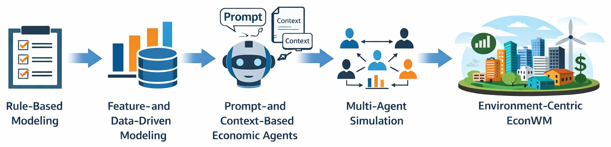

<h1 align="center">Awesome Economic World Models 🌐</h1>

  
  <!-- 
  
  -->
  A curated collection of papers, projects, and resources on Economic World Models.

  

  

## 🔥 News
- [2026/03/16] Initial release of the Awesome-Econ-World-Models GitHub repository.

## 🌐 What are Economic World Models?

Economic World Models (EconWMs) aim to build computational environments where heterogeneous agents, institutions, markets, and information interact dynamically over time.  
They go beyond static prediction by enabling **simulation, counterfactual reasoning, policy evaluation, and decision support** in economic and business systems.

---

## 🗂️ Table of Contents

- [Getting Started with World Models](#getting-started-with-world-models)
  - [Surveys and Tutorials](#-surveys-and-tutorials)
  - [General World Models](#-general-world-models)
  - [Generative and Interactive World Models](#-generative-and-interactive-world-models)

- [Economic World Models](#-economic-world-models)
  - [Rule-Based Economic Modeling](#-rule-based-economic-modeling)
  - [Feature- and Data-Driven Economic Modeling](#-feature--and-data-driven-economic-modeling)
  - [Prompt- and Context-Based Economic Agents](#-prompt--and-context-based-economic-agents)
  - [Multi-Agent Economic Simulation](#-multi-agent-economic-simulation)
  - [Environment-Centric Economic World Models](#-environment-centric-economic-world-models)
    
- [Projects and Platforms](#-projects-and-platforms)
  
- [Blogs and Perspectives](#-blogs-and-perspectives)

- [Contributing](#-contributing)

---
## Getting Started with World Models

### 📚 Surveys and Tutorials

Broad overviews that help newcomers understand the landscape.

- Understanding World or Predicting Future? A Survey of World Models. [[Paper](https://arxiv.org/abs/2411.14499)]
  
- From Efficient Multimodal Models to World Models: A Survey. [[Paper](https://arxiv.org/abs/2407.00118)]

- A Comprehensive Survey on World Models for Embodied AI. [[Paper](https://arxiv.org/abs/2510.16732)]

### 🔹 General World Models

Foundational papers that shape the modern notion of learning internal models of environment dynamics.

- World Models. David Ha, Jürgen Schmidhuber, 2018. 

- Dream to Control: Learning Behaviors by Latent Imagination.  Danijar Hafner et al., 2019. 
 
- Mastering Atari with Discrete World Models. Danijar Hafner et al., 2021.

- Mastering Diverse Domains through World Models. Danijar Hafner et al., 2023.

### 🎬 Generative and Interactive World Models

Representative works that extend world models from latent RL environments to multimodal generation, interactive simulation, and embodied environments.

- Learning to Model the World with Language. Jialu Lin et al., 2023.

- Video Generation Models as World Simulators. OpenAI, 2024.

- GAIA-1: A Generative World Model for Autonomous Driving. Wayve, 2023.

- Genie 2: A Large-Scale Foundation World Model. Google DeepMind, 2024.

- SIMA / SIMA 2
- Embodied AI Agents: Modeling the World
  
- Embodied AI: From LLMs to World Models

---

## 🌐 Economic World Models

This section traces the evolution of economic modeling from rules and data to agents, multi-agent interaction, and full economic environments.

  

### 📏 Rule-Based Economic Modeling

#### &nbsp;&nbsp;&nbsp;&nbsp;&nbsp;&nbsp;&nbsp;Microeconomics
- **General Equilibrium**: "Existence of an Equilibrium for a Competitive Economy", **`Econometrica 1954.07`**. [[Paper](https://doi.org/10.2307/1907353)]
- **Nash Equilibrium**: "Non-Cooperative Games", **`Econometrica 1951.09`**. [[Paper](https://doi.org/10.2307/1969529)]

#### &nbsp;&nbsp;&nbsp;&nbsp;&nbsp;&nbsp;&nbsp;Macroeconomics
- **Neoclassical Synthesis (IS-LM)**: "Mr. Keynes and the "Classics"; A Suggested Interpretation", **`Econometrica 1937.04`**. [[Paper](https://doi.org/10.2307/1907242)]
- **New Classical (RBC)**: "Time to Build and Aggregate Fluctuations", **`Econometrica 1982.11`**. [[Paper](https://doi.org/10.2307/1913386)]

#### &nbsp;&nbsp;&nbsp;&nbsp;&nbsp;&nbsp;&nbsp;Micro+Macro
- **CGE**: "Applied General-Equilibrium Models of Taxation and International Trade: An Introduction and Survey", **`JEL 1984.09`**. [[Paper](https://www.jstor.org/stable/2725306)]
- **DSGE**: "Shocks and Frictions in US Business Cycles: A Bayesian DSGE Approach", **`AER 2007.06`**. [[Paper](https://doi.org/10.1257/aer.97.3.586)]

### 📊 Feature- and Data-Driven Economic Modeling

#### &nbsp;&nbsp;&nbsp;&nbsp;&nbsp;&nbsp;&nbsp;Feature Engineering
- **Feature Engineering for ML Signals**: "Machine Learning from a Universe of Signals: The Role of Feature Engineering" **`UTD-J. Financ. Econ. 2025.10`**. [[Paper](https://doi.org/10.1016/j.jfineco.2025.104138)]
- **Transaction-Based Fraud Detection Features**: "Peer-to-Peer Loan Fraud Detection: Constructing Features from Transaction Data" **`UTD-MIS 2022.09`**. [[Paper](https://doi.org/10.25300/MISQ/2022/16103)]
- **Photo-Based Sentiment Index**: "A Picture Is Worth a Thousand Words: Measuring Investor Sentiment by Combining Machine Learning and Photos from News" **`UTD-J. Financ. Econ. 2022.04`**. [[Paper](https://doi.org/10.1016/j.jfineco.2021.06.002)]
- **Text-Based Volatility Signal**: "News Implied Volatility and Disaster Concerns" **`UTD-J. Financ. Econ. 2017.01`**. [[Paper](https://doi.org/10.1016/j.jfineco.2016.01.032)]
- **Informed Trading Measure**: "Informed Trading Intensity" **`UTD-J. Finance 2024.02`**. [[Paper](https://doi.org/10.1111/jofi.13320)]

#### &nbsp;&nbsp;&nbsp;&nbsp;&nbsp;&nbsp;&nbsp;Deep Learning
- **DL for Pricing**: "Deep Learning in Asset Pricing" **`UTD-Manage. Sci. 2024.02`**. [[Paper](https://doi.org/10.1287/mnsc.2023.4695)]
- **Vocal Tone DL Model**: "Listen Closely: Measuring Vocal Tone in Corporate Disclosures" **`UTD-J. Account. Res. 2025.09`**. [[Paper](https://doi.org/10.1111/1475-679X.70015)]
- **Dynamic Graph Neural Network for Stocks**: "Inductive Representation Learning on Dynamic Stock Co-Movement Graphs for Stock Predictions" **`UTD-INFORMS J Comput 2022.07`**. [[Paper](https://doi.org/10.1287/ijoc.2022.1172)]

#### &nbsp;&nbsp;&nbsp;&nbsp;&nbsp;&nbsp;&nbsp;Language Model
- **Knowledge-Enhanced Text Embedding**: "Analyzing Firm Reports for Volatility Prediction: A Knowledge-Driven Text-Embedding Approach" **`UTD-INFORMS J Comput 2022.01`**. [[Paper](https://doi.org/10.1287/ijoc.2020.1046)]
- **FinBERT**: "FinBERT: A Pre-trained Financial Language Representation Model for Financial Text Mining" **`IJCAI 2021.01`**. [[Paper](https://www.ijcai.org/proceedings/2020/0622.pdf)]
- **BloombergGPT**: "BloombergGPT: A Large Language Model for Finance" **` arXiv 2023.03`**. [[Paper](https://arxiv.org/abs/2303.17564)]

### 🧠 Prompt- and Context-Based Economic Agents
- **LLM as Homo Silicus**: "Large Language Models as Simulated Economic Agents: What Can We Learn from Homo Silicus?" **`NBER 2023.04`**. [[Paper](https://doi.org/10.3386/w31122)]
- **Context-Aware LLM for Market Impact**: "Context-Aware Language Models for Forecasting Market Impact from Sequences of Financial News" **`arXiv 2025.09`**. [[Paper](https://arxiv.org/abs/2509.12519)]
- **LASER&BEAM**: "Let the Laser Beam Connect the Dots: Forecasting and Narrating Stock Market Volatility" **`UTD-INFORMS J Comput 2024.11`**. [[Paper](https://doi.org/10.1287/ijoc.2022.0055)]
- **Strategic Prompt Engineering**: "The Crowdless Future? Generative AI and Creative Problem-Solving" **`UTD-Organ. Sci. 2024.09`**. [[Paper](https://doi.org/10.1287/orsc.2023.18430)]
- **Persona-based Prompting**: "Prompting for Policy: Forecasting Macroeconomic Scenarios with Synthetic LLM Personas" **`ICAIF 2025.11`**. [[Paper](https://doi.org/10.1145/3768292.3770385)]
- **GPT Economic Rationality**: "The Emergence of Economic Rationality of GPT" **`arXiv 2023.05`**. [[Paper](https://arxiv.org/abs/2305.12763)]
- **GPT Game Theory**: "GPT in Game Theory Experiments" **`arXiv 2023.05`**. [[Paper](https://arxiv.org/abs/2305.05516)]

### 🤖 Multi-Agent Economic Simulation

#### &nbsp;&nbsp;&nbsp;&nbsp;&nbsp;&nbsp;&nbsp;Classical Agent-Based Economics
- **ABCE1**: "Agent-Based Computational Economics: Growing Economies From the Bottom Up" **`Artif. Life 2002.01`**. [[Paper](https://doi.org/10.1162/106454602753694765)]
- **ABCE2**: "Handbook of Computational Economics, Vol. 2: Agent-Based Computational Economics" **`INFORMS J. Appl. Anal. 2007.05`**. [[Paper](https://www.proquest.com/openview/9078c2bf5489543503e757f6167ad313/1?pq-origsite=gscholar&cbl=6197)]
- **Complexity Economics**: "Foundations of Complexity Economics" **`Nat. Rev. Phys. 2021.01`**. [[Paper](https://doi.org/10.1038/s42254-020-00273-3)]
- **First Modern ABM**: "Investment rules, margin, and market volatility" **`JPM 1989.04`**. [[Paper](https://doi.org/10.3905/jpm.1989.409233)]
- **ABM Financial Markets Survey**: "Agent-Based Models of Financial Markets" **`arXiv 2007.01`**. [[Paper](https://arxiv.org/abs/physics/0701140)]
- **SABCEMM**: "Simulation of Stylized Facts in Agent-Based Computational Economic Market Models" **`arXiv 2018.11`**. [[Paper](https://arxiv.org/abs/1812.02726)]
- **Bounded Rationality ABM**: "Modeling the Out-of-Equilibrium Dynamics of Bounded Rationality and Economic Constraints" **`arXiv 2021.06`**. [[Paper](https://arxiv.org/abs/2106.00483)]
- **Flash Crash ABM**: "High-Frequency Financial Market Simulation and Flash Crash Scenarios Analysis: An Agent-Based Modelling Approach" **`arXiv 2022.08`**. [[Paper](https://arxiv.org/abs/2208.13654)]
- **ABIDES-Economist**: "ABIDES-Economist: Agent-Based Simulator of Economic Systems with Learning Agents" **`arXiv 2024.02`**. [[Paper](https://arxiv.org/abs/2402.09563)]
- **Social Media Bubble ABM**: "Simulation of Social Media-Driven Bubble Formation in Financial Markets using an Agent-Based Model with Hierarchical Influence Network" **`arXiv 2024.09`**. [[Paper](https://arxiv.org/abs/2409.00742)]
- **Prediction Market Manipulation**: "Manipulation in Prediction Markets: An Agent-Based Modeling Experiment" **`arXiv 2025.01`**. [[Paper](https://arxiv.org/abs/2601.20452)]

#### &nbsp;&nbsp;&nbsp;&nbsp;&nbsp;&nbsp;&nbsp;LLM-Based Multi-Agent Economic Simulation
- **Framework**: "A Multi-LLM-Agent-Based Framework for Economic and Public Policy Analysis" **`arXiv 2025.02`**. [[Paper](https://arxiv.org/abs/2502.16879)]
- **Digital Twin Behavioral Dataset**: "Twin-2K-500: A Data Set for Building Digital Twins of over 2,000 People Based on Their Answers to over 500 Questions" **`arXiv 2025.03`**. [[Paper](https://arxiv.org/abs/2505.17479)]
- **Macro Expectation Simulation**: "Simulating Macroeconomic Expectations Using LLM Agents" **`arXiv 2025.1`**. [[Paper](https://arxiv.org/abs/2505.17648)]
- **TwinMarket**: "TwinMarket: A Scalable Behavioral and Social Simulation for Financial Markets" **`arXiv 2025.10`**. [[Paper](https://arxiv.org/abs/2502.01506)]
- **EconAgent**: "EconAgent: Large Language Model-Empowered Agents for Simulating Macroeconomic Activities" **`arXiv 2023.10`**. [[Paper](https://arxiv.org/abs/2310.10436)]
- **ASFM**: "Simulating Financial Market via Large Language Model based Agents" **`arXiv 2024.06`**. [[Paper](https://arxiv.org/abs/2406.19966)]
- **LLM Trading Agents**: "Can Large Language Models Trade? Testing Financial Theories with LLM Agents in Market Simulations" **`arXiv 2025.04`**. [[Paper](https://arxiv.org/abs/2504.10789)]
- **TradingAgents**: "TradingAgents: Multi-Agents LLM Financial Trading Framework" **`arXiv 2024.12`**. [[Paper](https://arxiv.org/abs/2412.20138)]

### 🌍 Environment-Centric Economic World Models
- heterogeneous agents
- endogenous dynamics
- institutional and market constraints
- long-horizon simulation
- counterfactual and policy experimentation
- environment-level feedback between beliefs, actions, prices, and fundamentals
- **Game-Theoretic XAI Regulation Model**: "Regulating Explainable Artificial Intelligence (XAI) May Harm Consumers" **`UTD-Mark. Sci. 2025.05`**. [[Paper](https://doi.org/10.1287/mksc.2022.0396)]
- **Algorithmic Lending Competition Model**: "Algorithmic Lending, Competition, and Strategic Provision of Preapproval Tools" **`UTD-Mark. Sci. 2025.08`**. [[Paper](https://doi.org/10.1287/mksc.2023.0164)]
---

## 🛠️ Projects and Platforms

- **YuLan-OneSim** — A large-scale LLM-based social simulator that supports code-free scenario construction, distributed execution, and simulations with up to 100K agents across multiple social-science domains.  
  [[Paper]](https://arxiv.org/abs/2505.07581) [[Code]](https://github.com/RUC-GSAI/YuLan-OneSim) [[Docs]](https://ruc-gsai.github.io/YuLan-OneSim/)

- **MiroFish** — A multi-agent prediction engine that builds a parallel digital world from seed information (news, policies, financial signals) and simulates agent interactions for forecasting and scenario analysis.  
  [[Code]](https://github.com/666ghj/MiroFish) [[Demo]](https://666ghj.github.io/mirofish-live-demo/)

- **SocioVerse** — A social world simulator powered by LLM agents and a large-scale user pool, designed to simulate social dynamics across domains such as economics, politics, and media.  
  [[Paper]](https://arxiv.org/abs/2504.10157) [[Code]](https://github.com/FudanDISC/SocioVerse)

- **OASIS** — An open-source large-scale social interaction simulator that models dynamic online platforms and supports simulations with millions of agents.  
  [[Paper]](https://arxiv.org/abs/2411.11581) [[Code]](https://github.com/camel-ai/oasis)
  
---

## 📝 Blogs and Perspectives

---

## 🤝 Contributing

We welcome contributions on papers, projects, benchmarks, tutorials, and blog posts. Please feel free to open a pull request or issue if you would like to add relevant resources.
